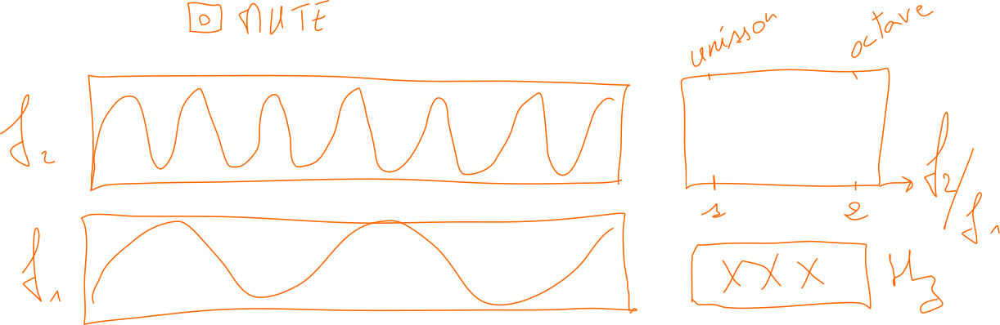

# Consonance sonore 

	Projet de 4 personnes

	Coordination avec le projet Analyse du son

Développement d'un outil pédagogique pour entraîner l'oreille à la [micro-tonalité](https://fr.wikipedia.org/wiki/Micro-intervalle) et aux différents [tempéraments](https://fr.wikipedia.org/wiki/Gammes_et_temp%C3%A9raments_dans_la_musique_occidentale).
Création d'une interface graphique permettant d'ajuster l'intervalle séparant deux ondes sonores.
La manipulation s'effectue à la souris et les sons sont ajustés en temps réels, de même que la représentation graphique de l'onde.

## Modules utilisés
- [tkinter](https://docs.python.org/3/library/tkinter.html) (_after_, _mouse event_)
- [matplotlib](https://matplotlib.org/stable/gallery/user_interfaces/embedding_in_tk_sgskip.html)
- [pygame](https://www.pygame.org/docs/)

## Paramètres d'entrée
- fréquence de l'onde de référence $f_1$
- fréquences $f_i \in [\frac{1}{2}f_1, 2f_1], \, i =2, \dots, N$

## Fonctionnalités

<!---
- Interface graphique --
 indication d'aspect :
 --->
 
- Représentation graphique de $2 \le N \le 5$ formes d'ondes sinusoïdales en échelle de couleur dans des cadres rectangulaires 
	+ saisie de $N$ au clavier
	+ saisie au clavier de la fréquence de l'onde de référence $f_1$
	+ saisie au clavier des autres fréquences $f_i \in [\frac{1}{2}f_1, 2f_1], \, i =2, \dots, N$
- Représentation graphique des deux ondes sinusoïdales en échelle de couleur dans des cadres rectangulaires avec possibilité de commutation entre les deux représentations.
- Ajustement en temps réel de la fréquence $f_2$ par saisie au clavier
- Ajustement en temps réel de la fréquence $f_2$ par compression/étirement de la représentation graphique de la forme d'onde au moyen de la souris avec coexistence du choix par saisie
- Ajustement fin si la touche _shift_ est appuyée
- Représentation en échelle logarithmique du rapport des fréquences $\eta = f_2/f1$ dans l'intervalle $[\frac{1}{2}, 2]$
- Émission audio de chaque son contrôlée par des interrupteurs individuels
- Présélection d'une gamme de valeurs de $\eta$ :
	+ mise en évidence des coïncidences des ces valeurs avec la fréquence choisie par l'utilisateur·rice 
	+ émission audio 
